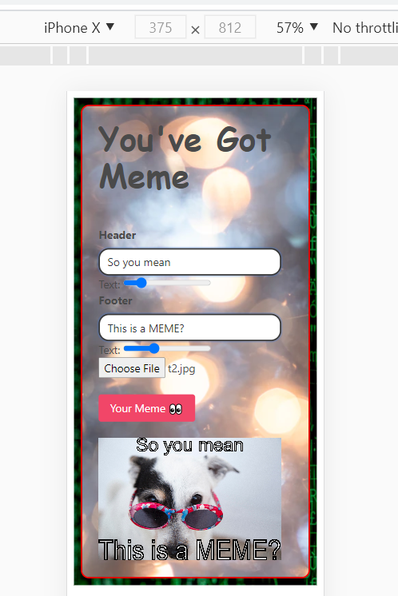
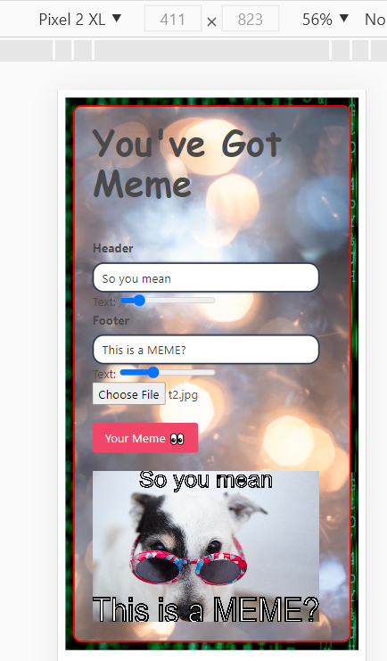

# You've Got Meme!

## Table of Contents
* [Introduction](#introduction)
* [User Story](#user)
* [Design Process](#design)
* [Technologies used](#api)
* [What can the app do?](#details)
* [Deployment](#installations)
* [Credits](#credits)
 
 ## Introduction 
One of those dasys when you feel funny and amused by looking at some memes on instagram, and then realising why not build a meme creator ! Icant believe that __Instagram__ inspired me to create this app.

 ## User Story
  1. As a User, I want to enter a set of words in the header and the footer section.
  2. As a User, I want to select an image by clicking on the Select file button, from my system on which I want to generate a meme.
  3. As a User, I am able to click the button to generate the final meme.
  4. As a User, I want to savethe generated meme by right clicking and saving the meme.

## Design Process
   * A very easy and responsive web app which lets you generate your own memes. 
   * Built using the basic frameworks of web development.
   * For additional styling and responsiveness, I used Bulma.
   * I used the canvas property to create and render a 2D image.
   * The images below show how the app looks on different screens

   __For iPhone X__
    
  
  
  __For Pixel 2XL__
  
 
 
 
  __Generated MEME__
  
 
 

 ##  Technologies used

  __Frameworks__ : I used the following frameworks and technologies for my application!
   * Bulma, CSS3 : For styling,
   * HTML5: For designing the frontend,
   *  JavaScript: for proper functioning of the application,
   *  FileReader API: to read the meme template.

   
 
 ## How does the app work?
 A gif has been attached which showswhat you end result will look like. But I have put in points the creation and functioning if the app.
 
  1. In the __index.html__ i created the base for writing the text for the header, footer, button to choose an image and then button for generating the created meme.
  2. Most of the styling was handled by __Bulma__ and th remaining was taken care of in the __style.css__ file.
  3. The __script.js__ is the brain behind the code.
  4. I created a DOM Content where all the data was created and relayed to the html id's.
  5. Functions for the working/ generating of header and footer were created.
  6.  Function for the working/ generating of the meme generator button was created.
  7. The user will enter a set of words in the header and the footer section
  8. Video of creating the meme:
  
     

 
 ## Deployment
  The app has been deployed on GITHUB, where all the codes are visible, and the working web app has been deployed on heroku
   * [The URL of the Github repo](https://github.com/Dipti2021/YouHaveGotMeme)
   *  [The URL of the app](https://dipti2021.github.io/YouHaveGotMeme/)

  ## Credits
    A special thanks to Aiden Threadgoode for helping me out with the header display
